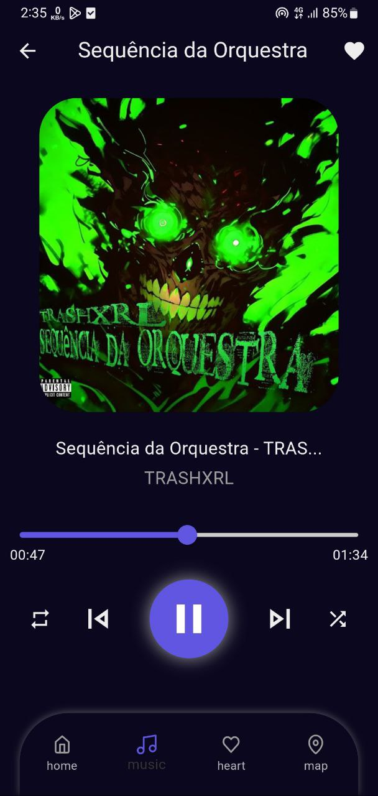

# Flutter Music Player Application Design

## This application is not completed yet. Currently, I am working on it. 
A small attempt to make an music player user interface in Flutter for Android and iOS.

## 🤓 Author(s)
**John** 

## Music Player App UI in Flutter

## ScreenShots
 &nbsp;&nbsp;&nbsp;&nbsp;  &nbsp;&nbsp;&nbsp;&nbsp;  

## ✨ Requirements
* Any Operating System (ie. MacOS X, Linux, Windows)
* Any IDE with Flutter SDK installed (ie.  Android Studio, VSCode, IntelliJ, etc)
* A little knowledge of Dart and Flutter
* A brain to think 🤓🤓

